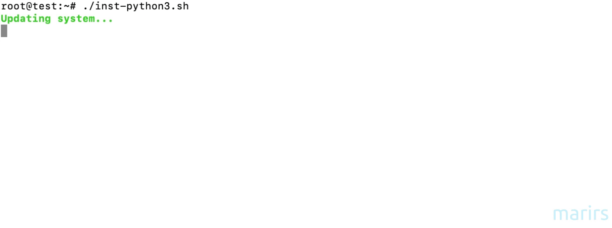

Python 3.x Installation with AI/ML Environment
==============================================


Installs Python 3.11.8 with comprehensive AI/ML environment setup, virtualenvwrapper, and essential development packages

---

## 🚀 Menu-Driven Installation

### Installation Options:
1. **Basic Python 3.x Installation** - Core Python with virtualenvwrapper
2. **Python 3.x + Data Science Environment** - NumPy, Pandas, Matplotlib, Jupyter
3. **Python 3.x + Machine Learning Environment** - Scikit-learn, XGBoost, LightGBM
4. **Python 3.x + Deep Learning Environment** - TensorFlow, PyTorch, Keras
5. **Python 3.x + Full AI/ML Environment** - Complete AI/ML stack
6. **Setup AI/ML Environment Only** - For existing Python installations

---

#### Features
- ✅ Latest stable Python 3.11.8 with optimized build
- ✅ Interactive menu system for customized installations
- ✅ Comprehensive AI/ML library collection
- ✅ Virtualenvwrapper for environment management
- ✅ AI/ML environment setup script (`setup-ai-env`)
- ✅ GPU detection and support (TensorFlow GPU)
- ✅ ARM64 and x86_64 support
- ✅ Detailed logging and error handling
- ✅ Development tools (Black, Flake8, pytest)
- ✅ MLOps tools (MLflow, DVC, WandB)

#### AI/ML Libraries Included:

**Data Science:**
- NumPy, Pandas, Matplotlib, Seaborn
- Scipy, Scikit-learn, Plotly, Bokeh
- Jupyter, JupyterLab, IPython

**Machine Learning:**
- XGBoost, LightGBM, CatBoost
- Imbalanced-learn, Feature-engine
- SHAP, Yellowbrick, Eli5

**Deep Learning:**
- TensorFlow (CPU/GPU), PyTorch, Keras
- OpenCV, Transformers, Datasets
- OpenAI Gym, Accelerate

**NLP:**
- NLTK, spaCy, Gensim, TextBlob
- Transformers, Tokenizers
- Sentence-transformers

**Computer Vision:**
- OpenCV, OpenCV-contrib, Pillow
- Scikit-image, Imageio

**MLOps:**
- MLflow, DVC, WandB, Optuna
- Prefect, Dagster, BentoML

**Development Tools:**
- Black, Flake8, pytest, mypy
- Pre-commit, isort

#### Tested on:
- Debian 9.x, 10.x, 11.x, 12.x, 13.x
- Ubuntu 18.04, 20.04, 22.04, 24.04

#### Requirements
- Root access (sudo)
- x86_64 or ARM64 architecture
- Internet connection

#### Installation steps

```bash
# Navigate to the Python directory
cd python3/

# Run the installation script
sudo ./inst-py3.sh

# Choose your installation mode:
# 1) Basic Python Installation
# 2) Python + Data Science Environment  
# 3) Python + Machine Learning Environment
# 4) Python + Deep Learning Environment
# 5) Python + Full AI/ML Environment (Recommended)
# 6) AI/ML Environment Only (if Python already installed)

# Follow the prompts and confirm installation
```

#### Quick Start Examples

**Basic Python Setup:**
```bash
# After installation
source ~/.bashrc
mkvirtualenv myenv
workon myenv
python --version
```

**AI/ML Environment Setup:**
```bash
# Create a full AI/ML environment
setup-ai-env ml-env full

# Activate the environment
workon ml-env

# Start Jupyter Lab
jupyter lab

# Test deep learning libraries
python -c "import torch; print('PyTorch:', torch.__version__)"
python -c "import tensorflow as tf; print('TensorFlow:', tf.__version__)"
```

**Environment Types:**
```bash
# Data Science environment
setup-ai-env ds-env datascience

# Machine Learning environment  
setup-ai-env ml-env ml

# Deep Learning environment
setup-ai-env dl-env deeplearning

# NLP environment
setup-ai-env nlp-env nlp

# Computer Vision environment
setup-ai-env cv-env cv

# Full AI/ML environment (recommended)
setup-ai-env ai-env full
```

#### AI/ML Environment Management

**Environment Script Usage:**
```bash
# Show help
setup-ai-env --help

# Create environment with custom name and type
setup-ai-env my-project datascience

# List available environments
lsvirtualenv

# Activate environment
workon my-project

# Deactivate environment
deactivate

# Remove environment
rmvirtualenv my-project
```

**Development Workflow:**
```bash
# 1. Create project environment
setup-ai-env my-project full

# 2. Activate and start working
workon my-project
cd ~/my-project

# 3. Start Jupyter for development
jupyter lab

# 4. Run tests
pytest

# 5. Format code
black .
flake8 .

# 6. Track experiments with MLflow
mlflow ui
```

#### GPU Support

The script automatically detects NVIDIA GPUs and installs GPU versions when available:

```bash
# Check if GPU is detected
nvidia-smi

# Test GPU support in TensorFlow
python -c "import tensorflow as tf; print('GPU Available:', tf.config.list_physical_devices('GPU'))"

# Test GPU support in PyTorch
python -c "import torch; print('CUDA Available:', torch.cuda.is_available())"
```

#### Example Projects

**Data Science Project:**
```python
# In your activated environment
import pandas as pd
import numpy as np
import matplotlib.pyplot as plt
import seaborn as sns
from sklearn.model_selection import train_test_split
from sklearn.ensemble import RandomForestClassifier

# Load and analyze data
df = pd.read_csv('data.csv')
sns.pairplot(df)
plt.show()
```

**Deep Learning Project:**
```python
import tensorflow as tf
from tensorflow import keras
import numpy as np

# Create a neural network
model = keras.Sequential([
    keras.layers.Dense(128, activation='relu', input_shape=(784,)),
    keras.layers.Dropout(0.2),
    keras.layers.Dense(10, activation='softmax')
])

model.compile(optimizer='adam',
              loss='sparse_categorical_crossentropy',
              metrics=['accuracy'])
```

**NLP Project:**
```python
import spacy
import nltk
from transformers import pipeline

# Load spaCy model
nlp = spacy.load('en_core_web_sm')

# Use transformers for sentiment analysis
classifier = pipeline('sentiment-analysis')
result = classifier("I love this AI/ML setup!")
print(result)
```

```bash
git clone https://github.com/marirs/autoinstalls.git
cd python3/
sudo ./inst-py3.sh
```

#### Post-Installation

After installation completes:

```bash
# Reload bash configuration
source ~/.bashrc

# Create virtual environment
mkvirtualenv myenv

# Test Python installation
python3.11 --version

# Test pip
python3.11 -m pip --version
```

#### What gets installed

**Python Components:**
- Python 3.11.8 (compiled from source)
- pip (latest version)
- virtualenvwrapper

**Development Packages:**
- Build tools (gcc, make, etc.)
- SSL/TLS libraries
- Database development headers
- Compression libraries
- Terminal utilities

#### Installation locations

- **Python**: `/usr/bin/python3.11`
- **Pip**: `/usr/bin/python3.11 -m pip`
- **Virtualenvwrapper**: `/usr/local/bin/virtualenvwrapper.sh`
- **Logs**: `/tmp/apt-packages.log`, `/tmp/py3-install.log`

#### Screen captures

- ./inst-py3.sh


---

#### Troubleshooting

**Common Issues:**

1. **Permission denied**: Run with `sudo`
2. **Architecture not supported**: Only x86_64 and ARM64 are supported
3. **Download failed**: Check internet connection and try again
4. **Build failed**: Check logs in `/tmp/py3-install.log`

**Getting Help:**

Check installation logs:
```bash
# Dependencies log
cat /tmp/apt-packages.log

# Python build log
cat /tmp/py3-install.log
```

---

#### Security Notes

- Downloads from official Python HTTPS sources
- Verifies download integrity
- Uses system SSL libraries
- No third-party repositories
